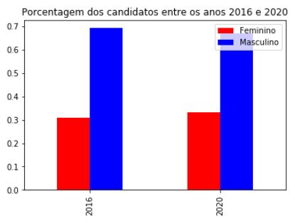
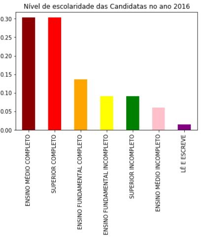
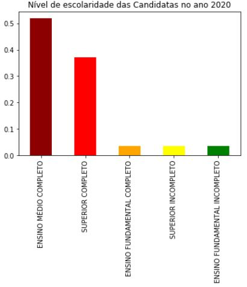

## Quantidade de mulheres candidatas a vereadora do município de Caçapava entre o ano 2016 e 2020.

### Será realizado um comparativo do número de candidatas mulheres, para os cargos de vereadora no município de Caçapava, incluso raça e grau de escolaridade entre os anos 2016 à 2020.

## Trabalho de Análise de Dados

**Disciplina:**  Laboratório de Banco de Dados

**Professor:**  Fernando Masanori

**Alunas:**  Érica dos Santos e Stephanie Costa

## Obtenção dos Dados

-   Dados das Candidatas, selecionar os anos correspondentes:
	- https://www.tse.jus.br/eleicoes/estatisticas/repositorio-de-dados-eleitorais-1

## Resumo
De acordo com os dados fornecidos pelo TSE entre os anos 2016 e 2020 podemos concluir que:

-	Entre os anos 2016 e 2020 houve um aumento no número de candidatas femininas;

  

-	O nivel de grau de escolaridade das candidatas aumentou com o decorrer dos anos;

  

  

